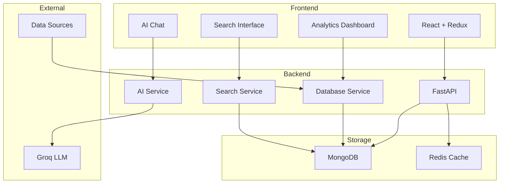

# 🤖 AI Data Agent

An intelligent data analysis platform that combines the power of AI with structured data to provide real-time insights, advanced search capabilities, and natural language querying.


## 🌟 Features

### 🔍 Advanced Search Capabilities
- **Hybrid Search**: Combines semantic, keyword, and fuzzy search
- **Real-time Search**: Instant results as you type
- **Smart Filters**: Category, tags, date range, and custom filters
- **Search History**: Track and reuse previous searches
- **Saved Searches**: Bookmark frequently used search queries
- **Export Results**: Download search results in JSON or CSV format

### 🤖 AI-Powered Insights
- **Natural Language Queries**: Ask questions in plain English
- **Intelligent Analysis**: Automatic data trend detection
- **Context-Aware Responses**: AI understands your data structure
- **Real-time Chat**: Interactive AI assistant for data exploration
- **Smart Suggestions**: AI-generated search and query suggestions

### 📊 Data Visualization
- **Interactive Dashboards**: Real-time data insights
- **Category Analytics**: Distribution and trend analysis
- **Performance Metrics**: Search and usage statistics
- **Custom Charts**: Configurable data visualizations

### 🔧 Developer Features
- **RESTful API**: Comprehensive API for all functionalities
- **WebSocket Support**: Real-time updates and notifications
- **Scalable Architecture**: Built for high-performance deployments
- **Extensible Design**: Easy to add new data sources and AI models

## 🏗️ Architecture



## 🚀 Quick Start

### Prerequisites
- Python 3.11+
- Node.js 18+
- MongoDB 6.0+
- Redis 7+
- Groq API Key

### 1. Clone the Repository
```bash
git clone https://github.com/yourusername/ai-data-agent.git
cd ai-data-agent
```

### 2. Environment Setup
```bash
# Copy environment templates
cp .env.development.example .env
cp backend/.env.example backend/.env  
cp frontend/.env.example frontend/.env.local

# Edit with your configuration
nano .env                    # Main configuration
nano backend/.env           # Backend-specific settings
nano frontend/.env.local    # Frontend settings
```

**Required Environment Variables:**
- `GROQ_API_KEY`: Your Groq API key for AI functionality
- `MONGODB_URI`: MongoDB connection string
- `SECRET_KEY`: JWT secret key (generate with `openssl rand -hex 32`)
- `REACT_APP_API_BASE_URL`: Frontend API endpoint

See [ENVIRONMENT.md](ENVIRONMENT.md) for detailed configuration guide.

### 3. Quick Deploy with Script
```bash
# Make deploy script executable
chmod +x deploy.sh

# Run deployment
./deploy.sh
```

### 4. Manual Setup

#### Backend Setup
```bash
cd backend

# Create virtual environment
python -m venv venv
source venv/bin/activate  # Windows: venv\\Scripts\\activate

# Install dependencies
pip install -r requirements.txt

# Start the server
uvicorn app.main:app --reload --host 0.0.0.0 --port 8000
```

#### Frontend Setup
```bash
cd frontend

# Install dependencies
npm install

# Start development server
npm start
```

### 5. Access the Application
- **Frontend**: http://localhost:3000
- **Backend API**: http://localhost:8000
- **API Documentation**: http://localhost:8000/docs

## 🔧 Configuration

### Environment Variables
```bash
# Database Configuration
MONGODB_URI=mongodb://localhost:27017/ai_data_agent
REDIS_URL=redis://localhost:6379

# AI Configuration
GROQ_API_KEY=your_groq_api_key_here
AI_MODEL=llama-3.1-8b-instant

# Security
SECRET_KEY=your_super_secret_key_here
ALGORITHM=HS256
ACCESS_TOKEN_EXPIRE_MINUTES=30

# API Configuration
API_V1_STR=/api/v1
ALLOWED_ORIGINS=[\"http://localhost:3000\"]
```

### MongoDB Setup
```javascript
// Create indexes for optimal performance
db.structured_data.createIndex({ \"title\": \"text\", \"description\": \"text\" });
db.structured_data.createIndex({ \"category\": 1 });
db.structured_data.createIndex({ \"tags\": 1 });
db.structured_data.createIndex({ \"created_at\": -1 });
```

## 📊 API Documentation

### Core Endpoints

#### Search API
```bash
# Basic search
POST /api/v1/search/
{
  \"query\": \"your search query\",
  \"search_type\": \"hybrid\",
  \"limit\": 50
}

# Advanced search
POST /api/v1/search/advanced
{
  \"query\": \"advanced query\",
  \"filters\": [...],
  \"date_range\": {...}
}

# Get search suggestions
GET /api/v1/search/suggestions?query=partial_query

# Get search facets
GET /api/v1/search/facets?query=optional_query
```

#### AI Agent API
```bash
# Chat with AI
POST /api/v1/ai/chat
{
  \"message\": \"Analyze trends in my dataset\",
  \"context_records\": [...]
}

# Process query
POST /api/v1/ai/process-query
{
  \"query\": \"What are the top categories?\",
  \"context\": {...}
}

# Analyze data
POST /api/v1/ai/analyze
{
  \"data\": [...],
  \"analysis_type\": \"trends\"
}
```

#### Data Management API
```bash
# Upload data
POST /api/v1/data/upload
# Form data with file

# Get records
GET /api/v1/data/records?limit=50&offset=0

# Analytics
GET /api/v1/data/analytics/categories
GET /api/v1/data/analytics/time-distribution
```

### WebSocket Endpoints
```bash
# Real-time search
ws://localhost:8000/ws/search

# AI chat stream
ws://localhost:8000/ws/ai-chat

# Data updates
ws://localhost:8000/ws/data-updates
```

## 🧪 Testing

### Backend Tests
```bash
cd backend

# Run all tests
pytest

# Run with coverage
pytest --cov=app tests/

# Run specific test file
pytest tests/test_search.py -v
```

### Frontend Tests
```bash
cd frontend

# Run all tests
npm test

# Run with coverage
npm test -- --coverage

# Run e2e tests
npm run test:e2e
```

### Integration Tests
```bash
# Start test environment
docker-compose -f docker-compose.test.yml up -d

# Run integration tests
pytest tests/integration/ -v

# Cleanup
docker-compose -f docker-compose.test.yml down
```

## 🚀 Deployment

### Docker Deployment
```bash
# Production deployment
docker-compose -f docker-compose.prod.yml up -d

# View logs
docker-compose logs -f

# Scale services
docker-compose up -d --scale backend=3
```

### Cloud Deployments

#### Heroku
```bash
# Backend
heroku create ai-data-agent-api
heroku config:set GROQ_API_KEY=your_key
git subtree push --prefix backend heroku main

# Frontend (Netlify/Vercel)
# Connect repository and set build command: npm run build
```

#### AWS ECS
```bash
# Build and push images
aws ecr get-login-password | docker login --username AWS
docker build -t ai-data-agent-backend backend/
docker tag ai-data-agent-backend:latest $AWS_ACCOUNT.dkr.ecr.$AWS_REGION.amazonaws.com/ai-data-agent-backend:latest
docker push $AWS_ACCOUNT.dkr.ecr.$AWS_REGION.amazonaws.com/ai-data-agent-backend:latest
```

See [DEPLOYMENT.md](DEPLOYMENT.md) for detailed deployment instructions.

## 🔄 Data Pipeline

### Supported Data Sources
- **Web Scraping**: Automated crawlers for websites
- **API Integration**: RESTful and GraphQL APIs
- **File Upload**: CSV, JSON, Excel files
- **Database Import**: SQL and NoSQL databases
- **Real-time Streams**: WebSocket and SSE

### Data Processing Pipeline
1. **Ingestion**: Data collection from various sources
2. **Validation**: Schema validation and data quality checks
3. **Transformation**: Data normalization and enrichment
4. **Indexing**: Full-text search index creation
5. **Storage**: Optimized storage in MongoDB
6. **AI Processing**: Embedding generation and analysis

### Sample Data Structure
```json
{
  \"id\": \"unique_identifier\",
  \"title\": \"Record Title\",
  \"description\": \"Detailed description\",
  \"content\": {
    \"field1\": \"value1\",
    \"field2\": \"value2\"
  },
  \"tags\": [\"tag1\", \"tag2\"],
  \"category\": \"category_name\",
  \"metadata\": {
    \"source\": \"data_source\",
    \"confidence\": 0.95
  },
  \"created_at\": \"2024-01-01T00:00:00Z\",
  \"updated_at\": \"2024-01-01T00:00:00Z\"
}
```

## 🎯 Use Cases

### Business Intelligence
- **Market Research**: Analyze competitor data and market trends
- **Customer Insights**: Process customer feedback and behavior data
- **Product Analytics**: Track product performance and user engagement
- **Financial Analysis**: Analyze financial data and reporting

### Content Management
- **Document Search**: Find relevant documents across large repositories
- **Knowledge Base**: Intelligent knowledge management system
- **Content Categorization**: Automatic content classification
- **Duplicate Detection**: Identify similar or duplicate content

### Research & Analytics
- **Academic Research**: Process and analyze research papers
- **Data Exploration**: Interactive data discovery and analysis
- **Trend Analysis**: Identify patterns and trends in time-series data
- **Sentiment Analysis**: Analyze sentiment in text data

## 🛠️ Development

### Project Structure
```
ai-data-agent/
├── backend/                 # FastAPI backend
│   ├── app/
│   │   ├── models/         # Data models
│   │   ├── routers/        # API routes
│   │   ├── services/       # Business logic
│   │   └── utils/          # Utilities
│   ├── tests/              # Backend tests
│   └── requirements.txt    # Python dependencies
├── frontend/               # React frontend
│   ├── src/
│   │   ├── components/     # React components
│   │   ├── services/       # API services
│   │   ├── store/          # Redux store
│   │   └── styles/         # CSS styles
│   ├── public/             # Static files
│   └── package.json        # Node dependencies
├── docs/                   # Documentation
├── docker-compose.yml      # Development environment
├── docker-compose.prod.yml # Production environment
└── deploy.sh              # Deployment script
```

### Technology Stack

#### Backend
- **Framework**: FastAPI 0.104+
- **Database**: MongoDB 6.0+ with Motor (async driver)
- **Cache**: Redis 7+ with aioredis
- **AI/ML**: Groq LLM, Langchain
- **Authentication**: JWT tokens
- **Testing**: Pytest, pytest-asyncio

#### Frontend
- **Framework**: React 18+
- **State Management**: Redux Toolkit
- **Styling**: Tailwind CSS
- **HTTP Client**: Axios
- **Testing**: Jest, React Testing Library
- **Build Tool**: Create React App

#### Infrastructure
- **Containerization**: Docker & Docker Compose
- **Orchestration**: Kubernetes (optional)
- **CI/CD**: GitHub Actions
- **Monitoring**: Prometheus, Grafana
- **Logging**: Structured logging with JSON format

### Adding New Features

#### 1. Backend Feature
```bash
# Create new service
touch backend/app/services/new_service.py

# Create API router
touch backend/app/routers/new_router.py

# Add tests
touch backend/tests/test_new_feature.py

# Update main.py to include router
```

#### 2. Frontend Feature
```bash
# Create component
mkdir frontend/src/components/NewFeature
touch frontend/src/components/NewFeature/NewFeature.js

# Create Redux slice
touch frontend/src/store/slices/newFeatureSlice.js

# Add to main App.js
```

### Performance Optimization

#### Backend Optimizations
- **Database Indexing**: Optimize MongoDB queries
- **Caching**: Implement Redis caching for frequent queries
- **Async Processing**: Use background tasks for heavy operations
- **Connection Pooling**: Optimize database connections

#### Frontend Optimizations
- **Code Splitting**: Lazy load components
- **Memoization**: Use React.memo and useMemo
- **Virtualization**: For large data lists
- **Bundle Analysis**: Optimize bundle size

## 🤝 Contributing

We welcome contributions! Please see our [Contributing Guidelines](CONTRIBUTING.md) for details.

### Development Setup
1. Fork the repository
2. Create a feature branch
3. Make your changes
4. Add tests
5. Submit a pull request

### Code Style
- **Python**: Follow PEP 8, use Black formatter
- **JavaScript**: Use Prettier, follow Airbnb style guide
- **Commits**: Use conventional commit messages

## 📄 License

This project is licensed under the MIT License - see the [LICENSE](LICENSE) file for details.

## 🙏 Acknowledgments

- **Groq**: For providing excellent LLM API
- **MongoDB**: For robust document database
- **FastAPI**: For high-performance async web framework
- **React**: For powerful frontend framework
- **Tailwind CSS**: For utility-first CSS framework

## 📞 Support

- **Documentation**: [docs/](docs/)
- **Issues**: [GitHub Issues](https://github.com/yourusername/ai-data-agent/issues)
- **Discussions**: [GitHub Discussions](https://github.com/yourusername/ai-data-agent/discussions)
- **Email**: support@aidataagent.com

## 🗺️ Roadmap

### Version 1.1
- [ ] Advanced analytics dashboard
- [ ] Custom AI model integration
- [ ] Multi-tenant support
- [ ] Advanced data connectors

### Version 1.2
- [ ] Mobile application
- [ ] Voice interface
- [ ] Automated reporting
- [ ] Advanced ML pipelines

### Version 2.0
- [ ] Distributed deployment
- [ ] Real-time collaboration
- [ ] Advanced security features
- [ ] Enterprise integrations

---

**Built with ❤️ for intelligent data analysis**